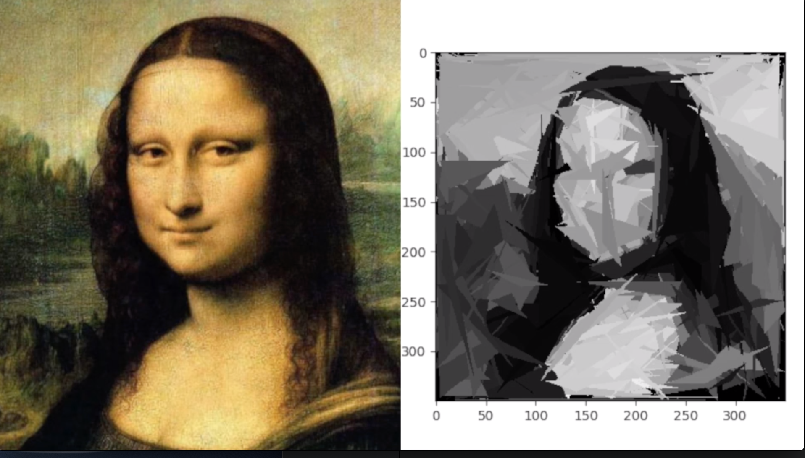

# Gioconda Reconstruction

This is a Python 3 Genetic Algorithm implementation for black and white reconstruction of images using random triangles, specifically featuring Da Vinci's artwork La Gioconda.




Check out the [visual demo](https://youtu.be/8Frn09aKMqI).


## Getting Started

Clone the repository

```
$ git clone https://github.com/gerarddo/gioconda-reconstruction.git 
```
Change directory

```
$ cd gioconda-reconstruction 
```

Run Jupyter
```
$ jupyter notebook
```

### Prerequisites

Required modules are
- numpy
- matplotlib
- scikit-image
- jupyter

### Installing

Run the following for installing modules:

```
$ pip install numpy matplotlib scikit-image jupyter
```

### Directory structure
- assets: contains the used images as .png files. 
- tools: contains modules and classes that work together to achieve the final result.

## About

**About Genetic Algorithms**

In computer science and mathematical optimization, a metaheuristic is a higher-level procedure or heuristic designed to find, generate, or select a heuristic (partial search algorithm) that may provide a sufficiently good solution to an optimization problem, especially with incomplete or imperfect information or limited computation capacity. Metaheuristics sample a set of solutions which is too large to be completely sampled. Metaheuristics may make few assumptions about the optimization problem being solved, and so they may be usable for a variety of problems.

Compared to optimization algorithms and iterative methods, metaheuristics do not guarantee that a globally optimal solution can be found on some class of problems. Many metaheuristics implement some form of stochastic optimization, so that the solution found is dependent on the set of random variables generated. In combinatorial optimization, by searching over a large set of feasible solutions, metaheuristics can often find good solutions with less computational effort than optimization algorithms, iterative methods, or simple heuristics. As such, they are useful approaches for optimization problems. Several books and survey papers have been published on the subject.

In computer science and operations research, a genetic algorithm (GA) is a metaheuristic inspired by the process of natural selection that belongs to the larger class of evolutionary algorithms (EA). Genetic algorithms are commonly used to generate high-quality solutions to optimization and search problems by relying on biologically inspired operators such as mutation, crossover and selection. John Holland introduced genetic algorithms in 1960 based on the concept of Darwin’s theory of evolution; his student David E. Goldberg further extended GA in 1989.

Sources: 
- [Metaheuristic - Wikipedia](https://en.wikipedia.org/wiki/Metaheuristic)
- [Genetic algorithm - Wikipedia](https://en.wikipedia.org/wiki/Genetic_algorithm)


**Reconstruction of Gioconda**

This code was originally written as a homework for the Computational Physics II class at ITESM and has been evolving along with my coding skills. It works as follows:

- The original image is converted to grayscale and used to determine the fitness of a given matrix with the same dimensions and whose elements are also between 0 and 1 (I call this matrix the DNA). Let's define m and n as the number of rows and columns of the matrix respectively.

- At the start of the main loop of the algorithm, k random DNA matrices are created and stored in an array/matrix/tensor of dimensions (m,n,k). We call this a population because it is a cumulate of multiple DNAs. 

- The fitness for each DNA inside a given population is calculated. The fittest DNA of the population is retrieved and stored to be used later in the evolution process and create fitter breadths.

- After the first random population is created, the next loop-cycles will use the fitter result and merge it (via a breeding algorithm) with new random DNAs to get a new/different population. Again, the fittest DNA of the population is retrieved and stored. This process goes on and on until a determined number of iterations is achieved. 

The result is a composition of random triangles making a rough recreation of the original Gioconda.


**TODO**: Add flowcharts


## Author

* **Gerardo Mijares** - [lapsusdev](https://lapsusdev.com)